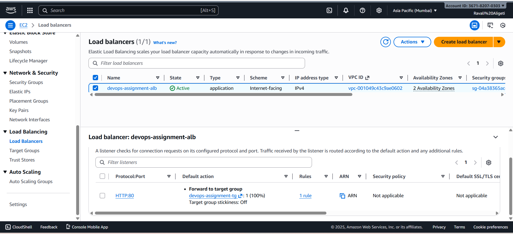
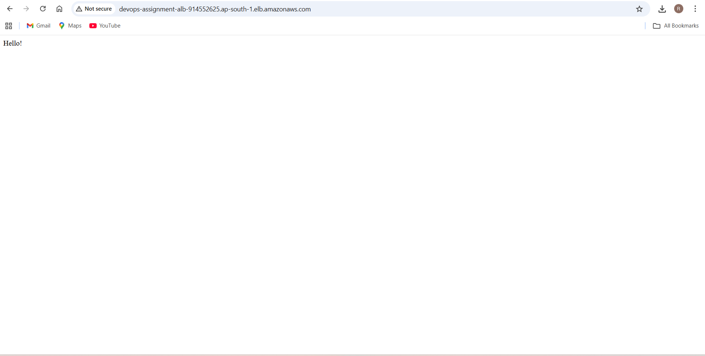
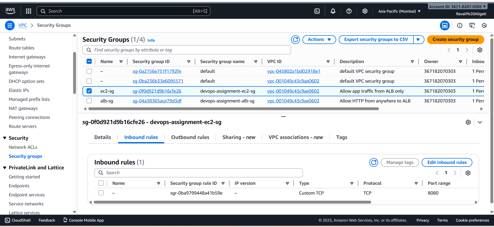

# Apt DevOps Assignment – AWS Terraform One-Click Deployment

This repository contains my solution for the Apt DevOps Backend / DevOps assignment.  
It uses **Terraform** to create a complete AWS environment and deploy a simple web app behind an **Application Load Balancer (ALB)**.

After a successful deploy:

- `http://devops-assignment-alb-914552625.ap-south-1.elb.amazonaws.com/` → returns **Hello!**
- `http://devops-assignment-alb-914552625.ap-south-1.elb.amazonaws.com/health` → returns **ok**

---

## Badges


---

## 1. Architecture (Conceptual)

High-level design:

- **VPC**
  - 2 public subnets (for ALB + NAT)
  - 2 private subnets (for EC2 instances)
- **Internet Gateway** attached to the VPC
- **NAT Gateway** in a public subnet for outbound internet from private subnets
- **Route tables**
  - Public route table → `0.0.0.0/0` via Internet Gateway
  - Private route table → `0.0.0.0/0` via NAT Gateway
- **Security groups**
  - `alb-sg` → allows HTTP (80) from the internet
  - `ec2-sg` → allows TCP 8080 **only** from `alb-sg`
- **Application Layer**
  - Application Load Balancer (ALB) listening on port 80
  - Target group (port 8080) with health check on `/health`
  - Launch template + Auto Scaling Group (ASG) with 2 EC2 instances
  - User data script runs a very simple HTTP server that serves:
    - `Hello!` on `/`
    - `ok` on `/health`


## 2. What Terraform Creates

### Networking
- Custom VPC  
- 2 public subnets  
- 2 private subnets  
- Internet Gateway  
- NAT Gateway  
- Public and private route tables with proper associations  

### Security
**ALB security group (alb-sg)**  
- Inbound: TCP 80 from 0.0.0.0/0  

**EC2 security group (ec2-sg)**  
- Inbound: TCP 8080 only from alb-sg  

### Load Balancing & Compute
- Application Load Balancer (ALB) in public subnets  
- Target group with health check on `/health`  
- Launch Template with simple user-data web app  
- Auto Scaling Group (ASG)  
  - Desired capacity: **2**
  - Instances run in **private subnets**

---

## 3. Repository Structure

```
aws-terraform-one-click-deployment/
│
├── project/
│   ├── main.tf            # Root Terraform file
│   ├── vpc.tf             # VPC, subnets, IGW, NAT, route tables
│   ├── security.tf        # Security groups
│   ├── compute.tf         # Launch template, ASG
│   ├── alb.tf             # ALB, target group, listener
│   ├── outputs.tf         # ALB DNS output
│   ├── variables.tf       # Input variables
│   └── user-data.sh       # Simple web app (Hello + health)
│
└── README.md
```

*(Names may differ slightly depending on how files were organized.)*

---

## 4. Prerequisites

- AWS account  
- IAM user with permissions for:
  - VPC, subnets, IGW, NAT, route tables  
  - EC2, Auto Scaling, Launch Templates  
  - Elastic Load Balancing  
- AWS CLI installed and configured:

```
aws configure
```

- Terraform 1.x installed

---

## 5. How to Deploy

Run all commands inside:

```
aws-terraform-one-click-deployment/project/terraform
```

### Step 1 — Clone repository
```
git clone https://github.com/Ravali-951/aws-terraform-one-click-deployment.git
cd aws-terraform-one-click-deployment/project/terraform
```

### Step 2 — Initialize Terraform
```
terraform init
```

### Step 3 — Review plan (optional)
```
terraform plan
```

### Step 4 — Apply infrastructure
```
terraform apply
```

Terraform will output the ALB DNS name:

```
alb_dns = "devops-assignment-alb-914552625.ap-south-1.elb.amazonaws.com"
```

---

## 6. How to Test

Use the ALB DNS output:

### Check root URL
```
http://devops-assignment-alb-914552625.ap-south-1.elb.amazonaws.com/
```
Expected:  
```
Hello!
```


### Check health endpoint
```
http://devops-assignment-alb-914552625.ap-south-1.elb.amazonaws.com/health
```
Expected:
```
ok
```


After successful deploy these are the outputs.


---

## 7. Screenshots Included

The following screenshots were captured and included:

1. VPC list
   
2. Subnets (public + private)
   
3. Route tables (public + private)  
5. Internet Gateway  
6. NAT Gateway  
7. Security groups (alb-sg, ec2-sg)  
8. Application Load Balancer  
9. Target group showing Healthy instances  
10. Auto Scaling Group with 2 running instances  
11. EC2 Instances  
12. Browser output for:
   - `/` → Hello!
   - `/health` → ok  

---


## Screenshots

### 1. Application Load Balancer


### 2. Target Group Health Check


### 3. API Test - Root Endpoint ( / )


### 4. API Test - Health Endpoint ( /health )


### 5. Private EC2 Instance (No Public IP)


### 6. ALB Security Group


### 7. EC2 Security Group


### 8. VPC Subnets (2 Public + 2 Private)


## 8. Cleanup

To remove all AWS resources:

```
terraform destroy
```

---

## 9. Notes

- Region used: **ap-south-1 (Mumbai)**  
- Instance type: **t3.micro**  
- Designed for clarity and extendability  

---

✨ Live Project Link

You can test the live deployed application here:

Root Endpoint:
👉 http://devops-assignment-alb-914552625.ap-south-1.elb.amazonaws.com/

Health Check:
👉 http://devops-assignment-alb-914552625.ap-south-1.elb.amazonaws.com/health


```

Special thanks to the Apt team for providing this assignment and the opportunity to demonstrate my skills. 🙏✨  
It was a great learning experience and I truly appreciate it.  

Thank you for reviewing my project! 😊👋

```


